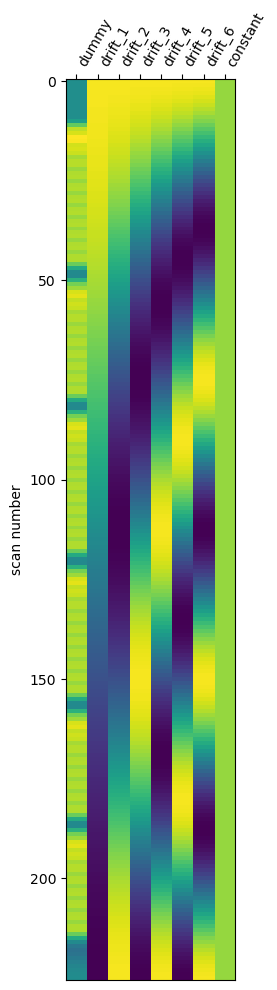

# 2024-msc-project-mri
MRI project for the 2024/25 MSc Cog Neurosci et al projects.

analysis, scripts, code for MSc project. python and matlab code, etc.

## Timeseries analysis

- [example fMRI data sub1 session 1 scan1](https://natural-scenes-dataset.s3.amazonaws.com/nsddata_timeseries/ppdata/subj01/func1pt8mm/timeseries/timeseries_session01_run01.nii.gz)

- the timing information (when which image occurred) is stored in these lists: [TSV file](https://natural-scenes-dataset.s3.amazonaws.com/nsddata_timeseries/ppdata/subj01/func1pt8mm/design/design_session01_run01.tsv)

- we can look at the 4D data file and try to make sense of it in a couple of different ways...

- for python code, you can have a look at the code in `test_timeseries.py` to see how to read in the data and the timing information.

## Data section 

- DS has signed data access agreement with original study authors (online) - for info, [this is here](https://cvnlab.slite.page/p/IB6BSeW_7o/Terms-and-Conditions)

- [the data manual](https://cvnlab.slite.page/p/CT9Fwl4_hc/NSD-Data-Manual) for the data set contains details of the file formats, etc. data for different experiments, etc.

- **how to get the data** - probably best to download ZIP files from AWS <https://cvnlab.slite.page/p/dC~rBTjqjb/How-to-get-the-data>

- [link to AWS store](https://natural-scenes-dataset.s3.amazonaws.com/index.html)

- want to work towards the **beta weights** from single trial GLM experiment <https://cvnlab.slite.page/p/6CusMRYfk0/Functional-data-NSD#bd0cbb9f> ... a good place to start would be to look at data from first catetory **betas_assumehrf (beta version 1; b1) - GLM in which a canonical HRF is used**

## Some ideas for getting started 

Some of the things here are ideas for `python` versions of analysis... but a bit further below, we can also look at `matlab`, which might be easier, given that you probably have a head-start with that.

- download a sample file. Eg for subject 1
- betas <https://natural-scenes-dataset.s3.amazonaws.com/nsddata_betas/ppdata/subj01/fsaverage/betas_assumehrf/lh.betas_session01.mgh> **this is a big file (for the LEFT hemisphere)... 400mb!**  - the corresponding file for **RIGHT hemisphere** is <https://natural-scenes-dataset.s3.amazonaws.com/nsddata_betas/ppdata/subj01/fsaverage/betas_assumehrf/rh.betas_session01.mgh>
- the file format is MGH and it's on the `fsaverage` brain
- see if you can write the code in `python` / using `nilearn`, `numpy` to read in that MGH file (or both) and display on `fsaverage` template.
- think about colour maps
- can you plot a histogram of all the values etc.
- a [youtube video by Kendrick Kay](https://www.youtube.com/watch?v=LfHowycsXLI) explaining how data is organised.

## Matlab version

- think about loading in MGH files into matlab (using functions from `/matlab` folder.
- talk about how data are organised
- think ahead to what kind of data we'll have from 7T experiments in Nottingham.

