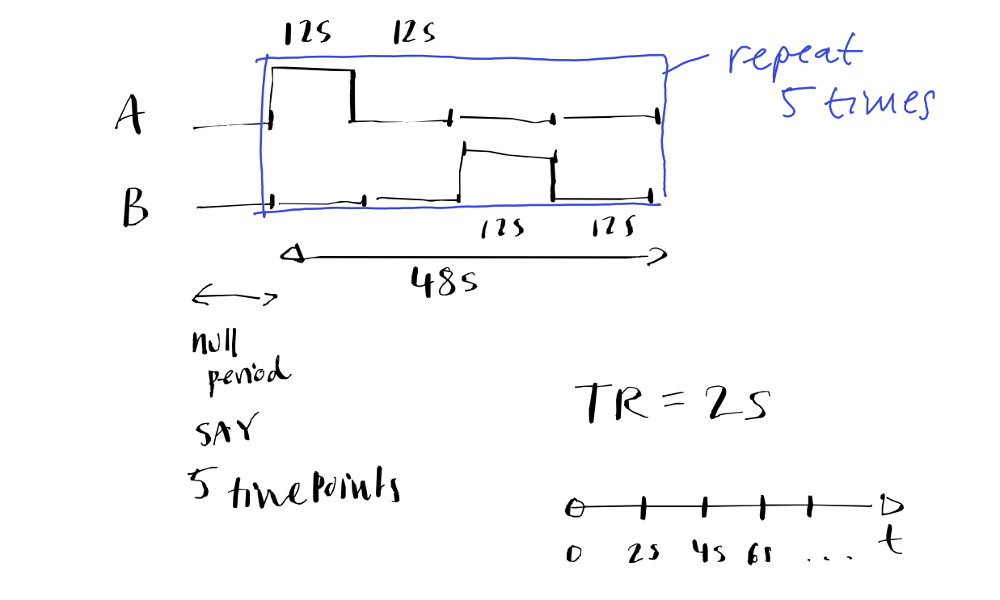

## Exercises

Building up some analysis code.

## 1 - stimulus time course

Write some matlab code that generates a stimulus timecourse for an `A-off-B-off` design. The stimulus should be a column vector. Each row should correspond to a time step (TR)... for now, assume that it is 2 seconds, but it may change in future.

- make one column for each condition
- each time step (row) should correspond to 2s
- 0 = stimulus off, 1 = stimulus on
- nullPeriod = 10s (5 TRs)
- A = 12s, B = 12s (6 TRs), off = 12s (6 TRs)
- repeat the stimulus block, say, 5 times.

Some useful matlab functions that may help:
- `zeros`, `ones`, `repelem`, `cat`, `size`, ...


Next step would be to write a function that can return those two columns stuck together.... once you have made it, you could call it like this:

```matlab
%                A&B, off, nullPeriod,  nBlocks
S = makeStimulus(12,   12,   10,        5);
```

## Diagram to see how the stimulus looks

